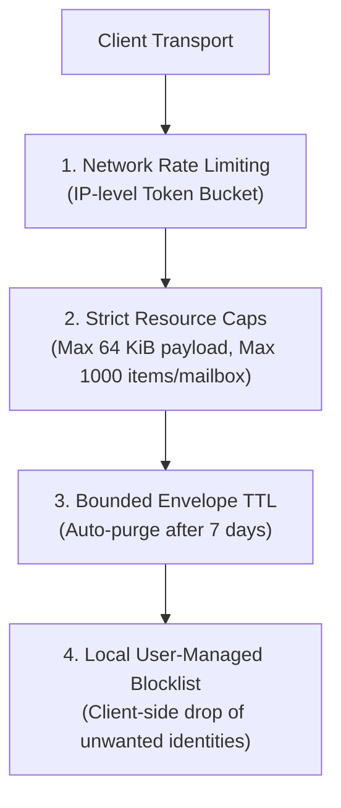

# ABUSE_MODEL.md — Abuse Containment & Resource Defense Model

## 1. The Abuse vs Privacy Dilemma

In traditional platforms, abuse moderation relies on inspecting message plaintexts, server-side content filtering, and linking accounts to real-world identities (phone numbers, credit cards).

**VEIL rejects server-side plaintext inspection while implementing robust cryptographic and resource-level abuse defenses.**

---

## 2. Abuse Defense Mechanisms

---

## 3. Threat Categories & Defenses

| Abuse Threat | Vector | VEIL Mitigation Strategy |
| :--- | :--- | :--- |
| **Relay Flooding / Storage Exhaustion** | Attacker spams millions of envelopes | Hard mailbox capacity bounds (`1000` envelopes), `64 KiB` max payload, short TTL (7 days). |
| **Contact Harassment** | Unwanted sender messages | Local user blocklist in `EncryptedSpaceStore`; messages dropped and acknowledged silently without notify. |
| **Media Bombing** | Sending massive files to exhaust bandwidth | Chunked 64 KiB media download requires user approval / tap-to-download; encrypted previews only. |
| **Typing / Heartbeat Spam** | Rapid interaction flood | 3-second minimum throttle enforced on typing signals (`PresencePrivacyManager`). |
