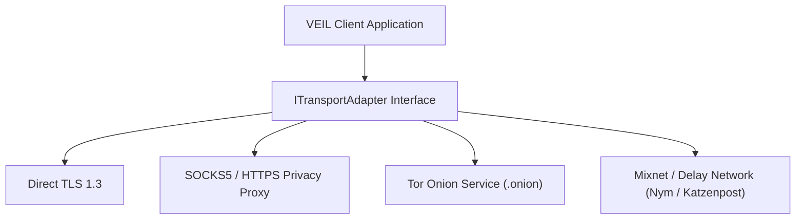

# ANONYMITY_NETWORKS.md — Network Layer Privacy & Anonymity Analysis

## 1. Transport Layer Isolation

VEIL's cryptographic messaging protocol is strictly decoupled from the underlying network transport via `ITransportAdapter`.

---

## 2. Anonymity Network Trade-off Matrix

| Transport Mechanism | IP Anonymity | Latency Impact | Battery Impact | Traffic Analysis Resistance |
| :--- | :--- | :--- | :--- | :--- |
| **Direct TLS 1.3** | None (Server sees client IP) | Minimal (10–50ms) | Low | Low (Requires Phase 8 jitter & padding) |
| **Encrypted SOCKS5 / VPN** | Hides IP from relay server | Moderate (+50–150ms) | Moderate | Moderate |
| **Tor (.onion routing)** | High (3-hop circuit anonymity) | High (+500–2500ms) | High | High (Masks source and destination IP) |
| **Mixnet / Loop Traffic** | High (Mixnet batching & delays) | Very High (+2–10s) | Very High | Very High (Resists global passive observers) |

---

## 3. Engineering Recommendations

- **Phase 8 Strategy**: Implement client-side size bucket padding, timing jitter, and batching to defend against local network wiretaps over direct TLS, while keeping latency acceptable for normal messaging.
- **Opt-in Transport**: Advanced users operating in high-threat environments can route `ITransportAdapter` traffic through Tor or SOCKS5 proxies without altering core Double Ratchet or group protocols.
