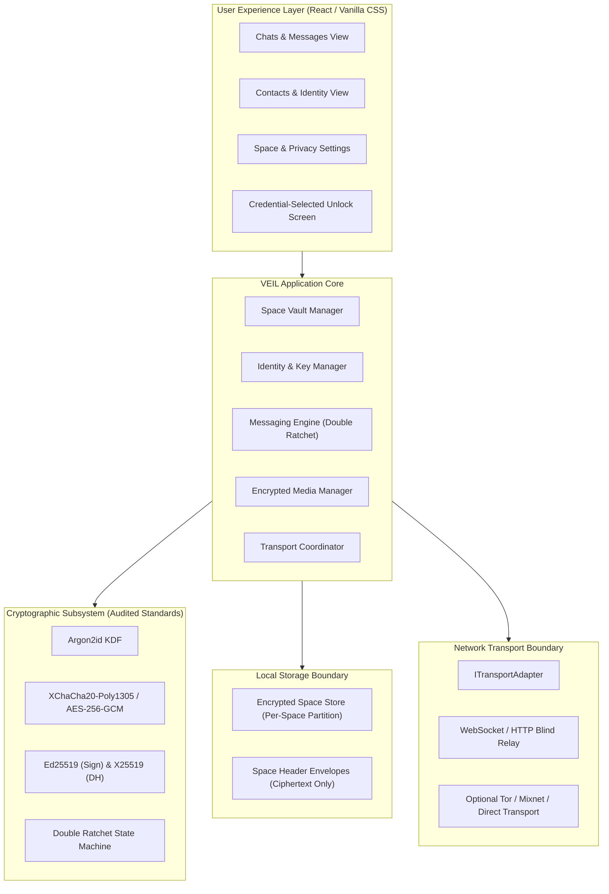
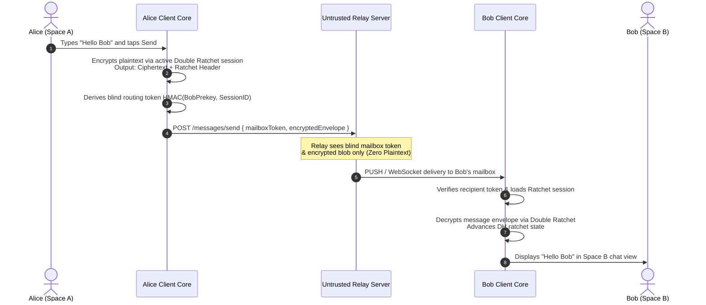

# ARCHITECTURE.md — VEIL System Architecture

## 1. System Overview

VEIL is an end-to-end encrypted, multi-space messaging system engineered with zero-trust server transport, cryptographic isolation between local user environments (Spaces), and a streamlined, mainstream-grade user experience.

---

## 2. Layered Component Architecture

### Layer 1: Cryptographic Core (`src/crypto/`)
- Pure, deterministic, audited cryptographic primitives.
- Standard interfaces for:
  - `Argon2id` password key derivation.
  - `AEAD` authenticated encryption/decryption (XChaCha20-Poly1305 / AES-256-GCM).
  - `Ed25519` keypair generation, message signing, and signature verification.
  - `X25519` key agreement (Diffie-Hellman scalar multiplication).
  - `HKDF-SHA256` domain-separated key expansion.
  - Secure memory zeroization (`zeroize(buffer)`).

### Layer 2: Space Vault Subsystem (`src/spaces/`)
- Manages Space metadata envelopes, credential unlocking, active session lifecycle, and cryptographic isolation.
- Enforces that no Space Master Key (SMK) is derived or held in memory for locked Spaces.
- Implements auto-lock, panic lock, and memory wiping routines.

### Layer 3: Identity & Contact Subsystem (`src/identity/`)
- Manages per-Space public/private keypairs (`SpaceIdentity`).
- Handles contact card serialization, safety number generation, and identity verification.
- Guarantees zero cross-space linkage.

### Layer 4: Messaging & Ratchet Subsystem (`src/messaging/`)
- Implements the Double Ratchet protocol (Diffie-Hellman ratchet + symmetric KDF ratchets) for post-compromise security and forward secrecy.
- Manages prekey bundles (Identity Key, Signed Prekey, One-Time Prekeys).
- Handles out-of-order message buffering and replay attack mitigation.

### Layer 5: Transport Subsystem (`src/transport/`)
- Implements `ITransportAdapter` abstraction.
- Interacts with untrusted relay servers using blind mailbox tokens (`HMAC-SHA256(RecipientPrekey, Token)`).
- Decouples client network logic from specific relay implementations.

### Layer 6: User Interface (`src/ui/`)
- Modern, clean, responsive UI with zero external paid framework dependencies.
- Complete separation of UI states per active Space.
- Strictly adheres to the VEIL Design System (`src/styles/`).

---

## 3. Data Flow: One-to-One Message Lifecycle

