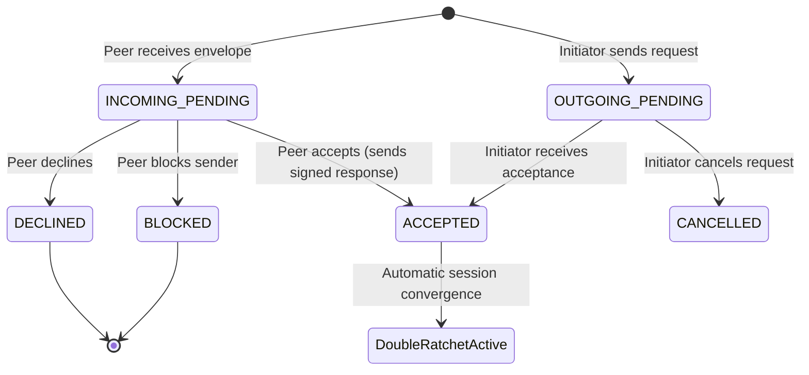

# VEIL — Contact Request UX & Lifecycle

## 1. Overview
VEIL provides a privacy-preserving contact discovery and request protocol. Users can search for peers by `@username` using rate-limited, anti-enumeration directory queries and send cryptographically signed contact requests without exchanging physical link payloads or out-of-band codes.

---

## 2. Contact Request State Machine

---

## 3. UI Interaction States

### A. Searching & Requesting
1. User enters `@username` ($\ge 3$ characters).
2. Live directory returns public profile document (`username`, `displayName`, `identityId`, `mailboxId`, `prekeyBundle`).
3. User reviews profile and clicks **+ Add Contact**, optionally entering a greeting.
4. UI displays **⏳ Pending Request**.

### B. Inbound Notification & Review
1. Recipient receives `CONTACT_REQUEST` envelope in background or upon sync.
2. Sidebar Contacts tab displays notification badge: `Contacts (N · 1 req)`.
3. Inbound request card displays sender's display name, `@username`, and custom greeting.
4. Recipient is offered three immediate actions:
   - **✓ Accept**: Establishes mutual address book entry and loads initial prekey bundle for immediate Double Ratchet messaging.
   - **✕ Decline**: Marks request declined and removes from active queue.
   - **🚫 Block**: Adds sender `identityId` to local blocklist; all future requests and messages from this sender are dropped silently.
