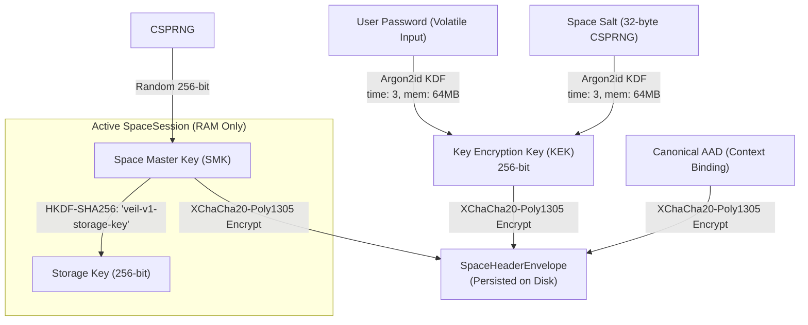

# CRYPTOGRAPHY.md — Selected Established Cryptographic Primitives & Specifications

## 1. Cryptographic Policy & Invariant

> **VEIL strictly enforces the rule: NEVER INVENT CRYPTOGRAPHY.**
> All algorithms, constructions, and parameter choices are based on established, published standards and maintained open-source libraries.

### Audit & Terminology Disclosure
VEIL uses **selected established cryptographic primitives** from mature, widely reviewed open-source libraries. No custom or proprietary ciphers, KDFs, PRNGs, or hash functions are implemented in VEIL. VEIL itself has not yet undergone an external third-party security audit; the terminology "audited" refers strictly to the upstream libraries where applicable.

---

## 2. Selected Cryptographic Primitives Matrix

| Primitive Category | Selected Algorithm | Library & Version | Standard / RFC | Purpose in VEIL |
| :--- | :--- | :--- | :--- | :--- |
| **Password KDF** | **Argon2id** | `@noble/hashes` (v1.7.0) | RFC 9106 | Derives Space Key Encryption Key (KEK) from user password |
| **Symmetric AEAD** | **XChaCha20-Poly1305** | `@noble/ciphers` (v2.3.0) | IETF draft-irtf-cfrg-xchacha | Encrypts and authenticates Space Master Key envelopes and partition store |
| **Key Expansion** | **HKDF-SHA256** | `@noble/hashes` (v1.7.0) | RFC 5869 | Expands Space Master Key into domain-separated storage subkeys |
| **Digital Signatures** | **Ed25519** | `@noble/curves` (v1.8.0) | RFC 8032 | Identity authentication, document self-signatures, and contact verification |
| **Key Agreement (DH)**| **X25519** | `@noble/curves` (v1.8.0) | RFC 7748 | Ephemeral and long-term Diffie-Hellman key exchange |
| **CSPRNG** | **WebCrypto API** | Native `crypto.getRandomValues` | W3C WebCrypto | Generates salts, nonces, and random Space Master Keys |

---

## 3. Authenticated Associated Data (AAD) Envelope Binding

To prevent **ciphertext transplantation attacks** (where an attacker moves a valid ciphertext blob into a different Space envelope or changes envelope metadata), VEIL enforces strict Authenticated Associated Data (AAD) binding during AEAD encryption and decryption of the Space Master Key (SMK).

### Canonical AAD Construction
$$\text{AAD} = \text{UTF-8}(\text{"VEIL-v1|version:"} \parallel \text{version} \parallel \text{"|spaceId:"} \parallel \text{spaceId} \parallel \text{"|alg:"} \parallel \text{algorithm} \parallel \text{"|salt:"} \parallel \text{salt})$$

```
+-----------------------------------------------------------------------------------+
|                            CANONICAL ENVELOPE AAD FORMAT                          |
|  "VEIL-v1|version:1|spaceId:f47ac10b-...|alg:XChaCha20-Poly1305|salt:q83jFk..."   |
+-----------------------------------------------------------------------------------+
```

- If an adversary attempts to transplant ciphertext into a different Space or tamper with the `spaceId`, `version`, or `salt`, the Poly1305 authentication tag check **fails immediately**.

---

## 4. Key Management & Separation



- The user password is **NEVER** used directly as the storage key.
- The Space Master Key is **independently generated** using CSPRNG.
- Passwords are fed strictly into Argon2id to derive the KEK.
- Identity key derivation is strictly deferred to Phase 2.
