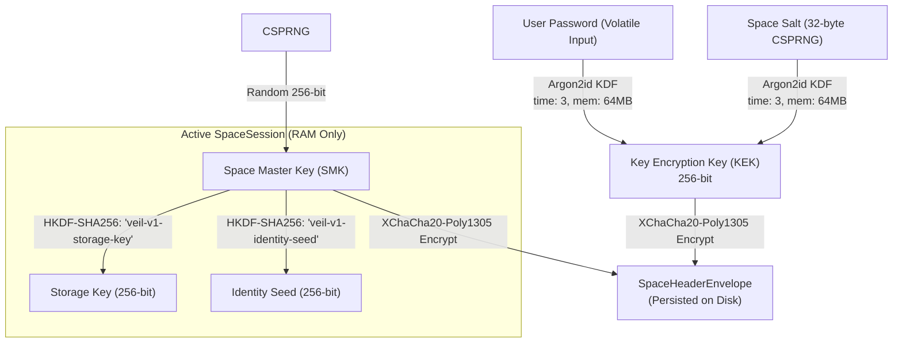

# CRYPTOGRAPHY.md — Selected Cryptographic Primitives & Specifications

## 1. Cryptographic Policy & Invariant

> **VEIL strictly enforces the rule: NEVER INVENT CRYPTOGRAPHY.**
> All algorithms, constructions, and parameter choices are based on established, published standards and maintained open-source libraries.

### Audit & Terminology Disclosure
VEIL uses **selected cryptographic primitives** from mature, widely reviewed open-source libraries. No custom or proprietary ciphers, KDFs, PRNGs, or hash functions are implemented in VEIL. VEIL itself has not yet undergone an external third-party security audit; the terminology "audited" refers strictly to the upstream libraries where applicable.

---

## 2. Selected Cryptographic Primitives Matrix

| Primitive Category | Selected Algorithm | Library & Version | Standard / RFC | Purpose in VEIL |
| :--- | :--- | :--- | :--- | :--- |
| **Password KDF** | **Argon2id** | `@noble/hashes` (v1.7.0) | RFC 9106 | Derives Space Key Encryption Key (KEK) from user password |
| **Symmetric AEAD** | **XChaCha20-Poly1305** | `@noble/ciphers` (v2.3.0) | IETF draft-irtf-cfrg-xchacha | Encrypts and authenticates Space Master Key envelopes and partition store |
| **Key Expansion** | **HKDF-SHA256** | `@noble/hashes` (v1.7.0) | RFC 5869 | Expands Space Master Key into domain-separated subkeys |
| **Digital Signatures** | **Ed25519** *(Planned Phase 2)* | `@noble/curves` (v1.8.0) | RFC 8032 | Identity authentication and contact verification |
| **Key Agreement (DH)**| **X25519** *(Planned Phase 2)* | `@noble/curves` (v1.8.0) | RFC 7748 | Ephemeral and long-term Diffie-Hellman key exchange |
| **CSPRNG** | **WebCrypto API** | Native `crypto.getRandomValues` | W3C WebCrypto | Generates salts, nonces, and random Space Master Keys |

---

## 3. Detailed Parameter Specifications & Security Assumptions

### 1. Password Key Derivation (Argon2id)
- **Library**: `@noble/hashes/argon2.js`
- **Algorithm**: Argon2id
- **Production Parameters**:
  - Memory cost ($m$): $65,536\text{ KiB}$ ($64\text{ MiB}$)
  - Time cost ($t$): $3\text{ iterations}$
  - Parallelism ($p$): $1\text{ thread}$
  - Salt length: $32\text{ bytes}$ ($256\text{ bits}$, generated per Space via CSPRNG)
  - Key length: $32\text{ bytes}$ ($256\text{ bits}$)
- **Why Selected**: Winner of the Password Hashing Competition (PHC). Provides superior resistance against GPU and ASIC memory-hard cracking compared to PBKDF2 or standard bcrypt.
- **Security Assumptions**: Adversary cannot brute-force a strong password without incurring massive memory and time costs per candidate guess.
- **Known Limitations**: Argon2id execution time is proportional to device hardware. Mobile/browser performance requires tuned iteration counts.

### 2. Envelope Authenticated Encryption (XChaCha20-Poly1305)
- **Library**: `@noble/ciphers/chacha.js`
- **Algorithm**: XChaCha20-Poly1305
- **Parameters**:
  - Key size: $256\text{ bits}$ ($32\text{ bytes}$)
  - Nonce size: $192\text{ bits}$ ($24\text{ bytes}$)
  - Tag size: $128\text{ bits}$ ($16\text{ bytes}$)
- **Why Selected**: 192-bit nonces eliminate the risk of nonce collision when generating random nonces via CSPRNG (unlike 96-bit AES-GCM where birthday-bound collision risks exist after $2^{32}$ messages).
- **Security Assumptions**: Random nonces from CSPRNG will never collide. Poly1305 tag validation prevents ciphertext tampering.

### 3. Key Expansion (HKDF-SHA256)
- **Library**: `@noble/hashes/hkdf.js`
- **Algorithm**: HKDF-SHA256 (RFC 5869)
- **Domain String Tags**:
  - Storage: `"veil-v1-storage-key"`
  - Identity Seed: `"veil-v1-identity-seed"`
  - Prekeys: `"veil-v1-prekey-seed"`
  - Media: `"veil-v1-media-key"`
- **Why Selected**: Cryptographically ensures domain separation; compromising one derived subkey provides zero mathematical advantage in compromising other subkeys derived from the same Space Master Key.

---

## 4. Key Management & Separation

- The user password is **NEVER** used directly as the storage or identity key.
- The Space Master Key is **independently generated** using CSPRNG.
- Passwords are fed strictly into Argon2id to derive the KEK.
