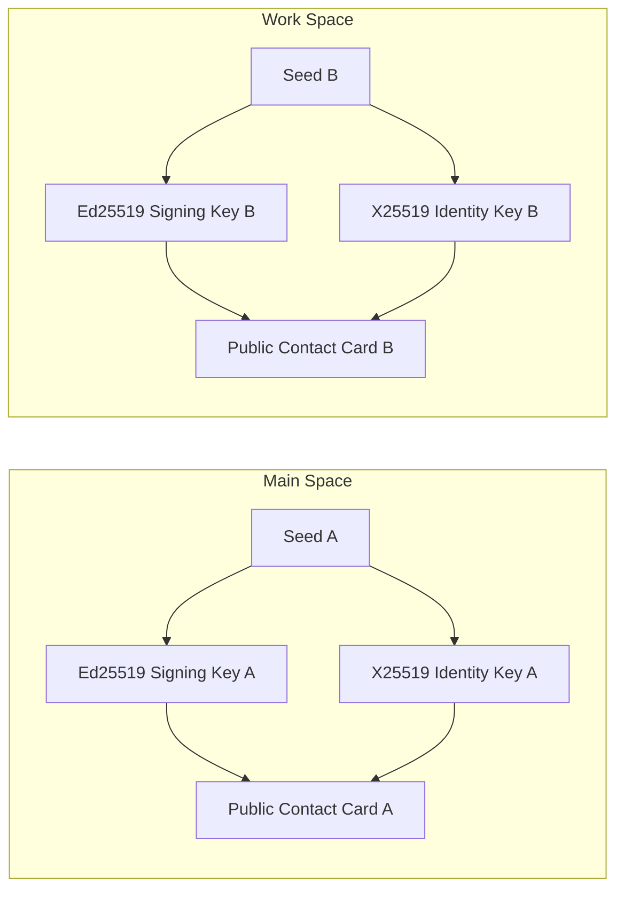

# IDENTITY_MODEL.md — Cryptographic Identity & Verification Model

## 1. Decentralized Cryptographic Identity

In VEIL, user identity is not tied to a centralized phone number, email address, or global user identifier. Instead, **each Space generates and owns an independent cryptographic identity**.



### Identity Unlinkability Invariant
There is **zero mathematical correlation** between `Identity A` and `Identity B`. An observer or relay server seeing communications from Identity A cannot determine that Identity B resides on the same device.

---

## 2. Identity Data Structures

```typescript
export interface SpaceIdentity {
  /** Local UUID of the Space */
  spaceId: string;
  
  /** Long-term Public Identity Key (X25519) - 32 bytes base64 */
  identityKeyPub: string;
  
  /** Long-term Private Identity Key (X25519) - 32 bytes base64 (RAM only) */
  identityKeyPriv: string;
  
  /** Long-term Public Signing Key (Ed25519) - 32 bytes base64 */
  signingKeyPub: string;
  
  /** Long-term Private Signing Key (Ed25519) - 32 bytes base64 (RAM only) */
  signingKeyPriv: string;
  
  /** User-configured profile display name */
  displayName: string;
  
  /** Creation timestamp */
  createdAt: number;
}
```

---

## 3. Contact Cards & QR Code Exchange

To connect two users, contact information is exchanged via URI or visual QR code:

```
veil://contact?ik=<Base64_X25519_IK>&sign=<Base64_Ed25519_Pub>&name=<DisplayName>
```

When Alice scans Bob's QR code:
1. Alice's client extracts Bob's public keys (`identityKeyPub` and `signingKeyPub`).
2. Alice verifies the signature over Bob's profile metadata.
3. Bob is added to Alice's active Space contact book.

---

## 4. Safety Numbers (Man-in-the-Middle Verification)

To verify the cryptographic authenticity of a contact and prevent relay impersonation attacks, VEIL generates a **Safety Number**:

$$\text{SafetyNumber} = \text{Format}(\text{SHA-256}(\text{Sort}(\text{IK}_{\text{Alice}}, \text{IK}_{\text{Bob}})))$$

- Displayed as a formatted 12-digit numeric fingerprint (e.g. `4829 1059 3820`).
- Users compare safety numbers in person or through an authenticated channel.
- Once verified, the contact is marked as **Cryptographically Verified** in the UI.
