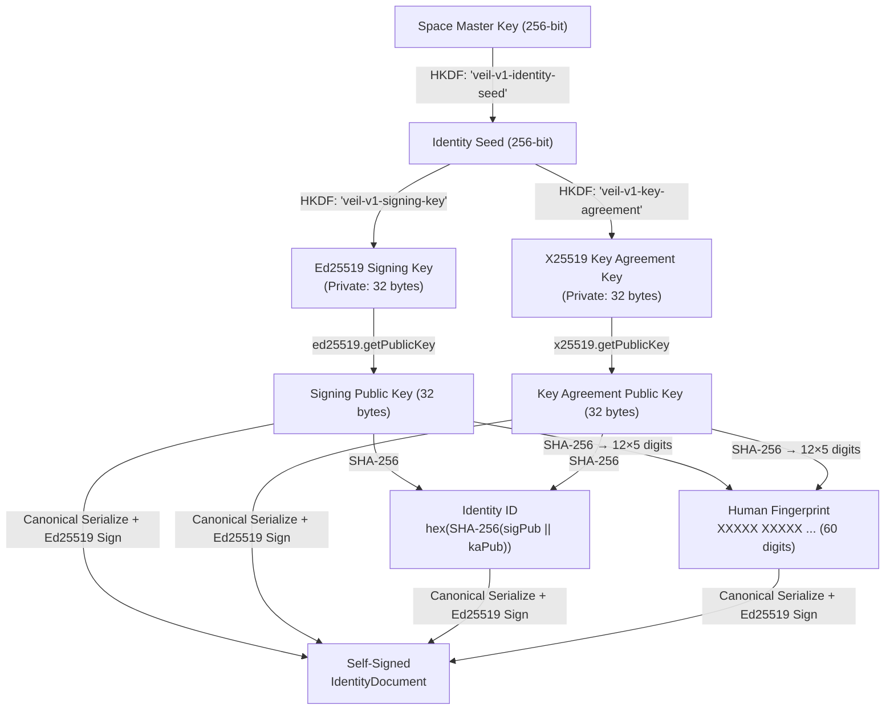

# IDENTITY_MODEL.md — Cryptographic Identity & Verification Model

## 1. Identity Architecture

In VEIL, each Space generates and owns an **independent cryptographic identity**. Identity is NOT tied to a phone number, email, username, device ID, or any centralized identifier.



### Identity Unlinkability Invariant
There is **zero mathematical correlation** between Identity A (Main Space) and Identity B (Private Space). An observer seeing communications from Identity A cannot determine that Identity B resides on the same device.

---

## 2. Identity Document Structure

```typescript
interface IdentityDocument {
  version: 1;
  identityId: string;              // hex(SHA-256(signingPub || kaPub))
  signingPublicKey: string;         // Base64 Ed25519 public key
  keyAgreementPublicKey: string;    // Base64 X25519 public key
  fingerprint: string;             // 12 groups of 5 digits (60 digits)
  createdAt: number;               // Unix timestamp
  signature: string;               // Base64 Ed25519 self-signature
}
```

**The document does NOT contain** private keys, passwords, SMKs, or Space names.

### Self-Signature Binding
The `signature` field is an Ed25519 signature over the canonical serialization of all other fields. This cryptographically proves that the signing key owner authorized the binding of the signing public key and key agreement public key into a single identity.

---

## 3. Canonical Serialization

Identity documents are serialized with **explicit field ordering** and **no whitespace**:

```
{"version":1,"identityId":"...","signingPublicKey":"...","keyAgreementPublicKey":"...","fingerprint":"...","createdAt":...}
```

The `signature` field is **excluded** from the canonical representation (since it is computed over this output).

This format is deterministic across all platforms, runtimes, and JSON implementations.

---

## 4. Human-Verifiable Fingerprint

$$\text{Fingerprint} = \text{Format}(\text{SHA-256}(\text{signingPub} \| \text{kaPub}))$$

Format: 12 groups of 5 digits, e.g. `48291 05938 20147 63825 91047 38204 17529 04836 29150 84726 39150 48372`

Users compare fingerprints through an independent channel to verify identity authenticity.

---

## 5. Identity Lifecycle

| Event | Identity Effect |
|---|---|
| Space created + identity initialized | New deterministic identity derived from SMK |
| Space locked | Private keys wiped from volatile memory |
| Space unlocked | Private keys re-derived or loaded from encrypted store |
| Password changed | **Identity unchanged** (same SMK, rewrapped under new KEK) |
| Space deleted | Private keys destroyed, encrypted store purged |
| Space cloned (copied storage) | **Same identity** (known limitation, see ADR-014) |

---

## 6. Key Purpose Separation

| Key | Algorithm | Purpose | MUST NOT be used for |
|---|---|---|---|
| Signing Key | Ed25519 | Authenticating messages, self-signing documents | Key agreement, encryption |
| Key Agreement Key | X25519 | Establishing shared secrets with peers | Signing, authentication |

These keys are independently derived via HKDF domain separation. Compromising one does not compromise the other.

---

## 7. Private Key Storage

Private identity keys are encrypted at rest via the Space's `StorageKey` (HKDF-derived from SMK) using XChaCha20-Poly1305. They are accessible only when the Space is unlocked.
