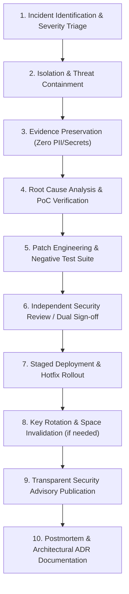

# INCIDENT_RESPONSE.md — Security Incident Response & Compromise Containment

## 1. 10-Step Incident Containment Workflow

---

## 2. Key Compromise Recovery Protocols

| Compromise Scenario | Impact Scope | User Action Required | System Enforcement |
| :--- | :--- | :--- | :--- |
| **Lost / Stolen Unlocked Device** | Active Space sessions exposed | Trigger Panic Lock remotely (or rotate keys from secondary enrolled device) | `revokeDevice()` publishes signed revocation tombstone |
| **Space Password Compromised** | Specific Space on specific device | Unlock Space immediately and run `changePassword()` | Re-derives Argon2id KEK and re-encrypts SMK envelope |
| **Device Linking SAS MITM Attempt** | Unauthorized device attempting enrollment | Reject SAS code mismatch on primary device | Ephemeral DH exchange aborted, no keys transferred |
| **Compromised Group Member** | Past message plaintext exported by member | Admin removes member via `removeMember()` | Monotonic epoch advance + immediate Sender Key rotation |
| **Relay Server Breach** | Attacker dumps relay database | Zero plaintext exposure (E2EE) | Rotate all client mailbox capabilities via `MailboxRotationManager` |
