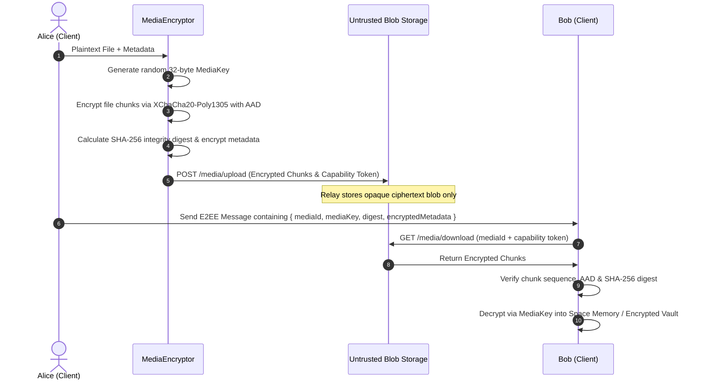

# MEDIA_SECURITY.md — VEIL Encrypted Media Vault & Untrusted Blob Transport

## 1. Overview & Threat Model

VEIL provides zero-trust, client-side encrypted media storage and transmission for images, audio recordings, video files, and documents.

### Core Principle
> **THE SERVER IS UNTRUSTED BLOB STORAGE.**
> The relay server never sees media plaintexts, file names, MIME types, dimensions, thumbnails, or media decryption keys.

---

## 2. Media Encryption Pipeline



---

## 3. Cryptographic Specification

### 3.1. Per-Object Key Isolation
- Every media item (image, audio note, attachment) generates a unique, cryptographically strong 32-byte key:
  $$\text{mediaKey} = \text{crypto.getRandomValues}(\text{new Uint8Array}(32))$$
- No media key is ever reused across files, conversations, or Spaces.

### 3.2. Streaming Chunk Encryption
For streaming efficiency and constant memory usage, files are partitioned into standard chunks (default: 64 KiB = 65,536 bytes):
- Each chunk $i \in [0, N-1]$ is encrypted with `mediaKey` using `XChaCha20-Poly1305`.
- **Authenticated Associated Data (AAD)**:
  ```json
  {
    "mediaId": "<mediaId>",
    "chunkIndex": 0,
    "totalChunks": 4,
    "isLastChunk": false
  }
  ```
- **Integrity Digest**: The receiver verifies that:
  1. All chunks $0 \dots N-1$ are present in exact order with valid Poly1305 tags.
  2. The combined decrypted plaintext matches the SHA-256 digest declared in the E2EE descriptor.

### 3.3. Key Delivery & URL Protection
- Decryption keys are **NEVER** placed in URLs, query strings, HTTP headers, or server databases.
- The `mediaKey` travels exclusively inside the end-to-end encrypted message payload (`RatchetMessage` or `GroupMessagePayload`).

---

## 4. Metadata & Thumbnail Privacy

- **Metadata Protection**: File name, exact MIME type, pixel dimensions, duration, and file captions are encrypted inside the `EncryptedMediaAttachment` metadata blob using `mediaKey`.
- **Thumbnails**: Thumbnails are either encrypted locally using the same `mediaKey` with a distinct nonce / AAD tag, or generated client-side upon decryption. Plaintext thumbnails are never sent to the server.
- **Size Normalization & Padding**: Media payloads are padded to standard size boundaries where practical to mitigate packet size fingerprinting.

---

## 5. Space Boundary & Local Gallery Isolation

1. **Space Isolation**: Media keys, decrypted blobs, and cached media belong to a single Space partition in `EncryptedSpaceStore`.
2. **Zero OS Gallery Leakage**: Private Space media is never automatically exported to shared Android / iOS / OS public photo libraries or shared file systems.
3. **Memory Hygiene**: Decrypted media buffers in memory are zeroized or garbage-collected when the viewing session or Space locks.
