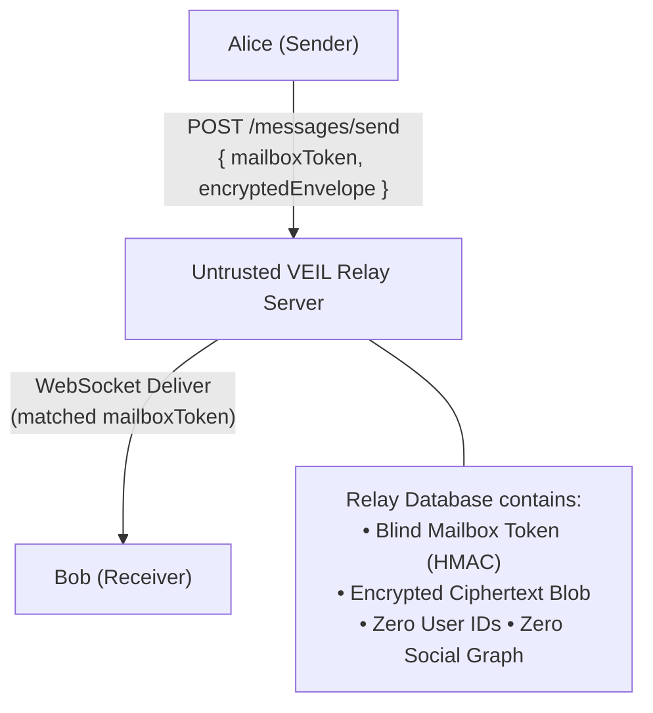

# METADATA_MODEL.md — Metadata Minimization & Traffic Privacy

## 1. The Metadata Problem

In standard messaging platforms, even when message plaintexts are end-to-end encrypted, relay servers log vast amounts of sensitive communication metadata:
- Who is speaking with whom (Social Graph)
- Exact timestamps and frequency of messages
- Message sizes and media attachment types
- User IP addresses and physical device identifiers

**VEIL is engineered to minimize all forms of communication metadata.**

---

## 2. Blind Mailbox Routing Scheme

VEIL eliminates centralized user identifiers and user-indexed routing tables on the relay server.

### Protocol Details
1. **Rotating Mailbox Tokens**: A message is not sent to "Bob"; it is addressed to an ephemeral `mailboxToken` derived using HMAC over Bob's public prekey:
   $$\text{MailboxToken} = \text{HMAC-SHA256}(\text{BobPrekeyPub}, \text{RatchetStepID})$$
2. **Blind Storage**: The server stores messages indexed strictly by `mailboxToken`.
3. **Zero Social Graph**: The server cannot correlate which `mailboxToken` belongs to which user or determine whether two mailboxes represent communication between the same pair of people.

---

## 3. Packet Padding & Traffic Analysis Mitigation

To prevent network observers and ISPs from deducing message types or conversation patterns from packet sizes:

1. **Fixed-Size Message Padding**: All message plaintexts are padded to standard block increments (e.g. 128 bytes, 512 bytes, 2048 bytes) using PKCS#7 or ISO/IEC 7816-4 padding before encryption.
2. **Uniform Media Blobs**: Encrypted media files are uploaded in chunked fixed-size blocks.
3. **Transport Decoupling**: The transport layer (`ITransportAdapter`) allows traffic to flow over standard TLS WebSockets, Tor hidden services, or mixnet proxies without modifying application logic.
