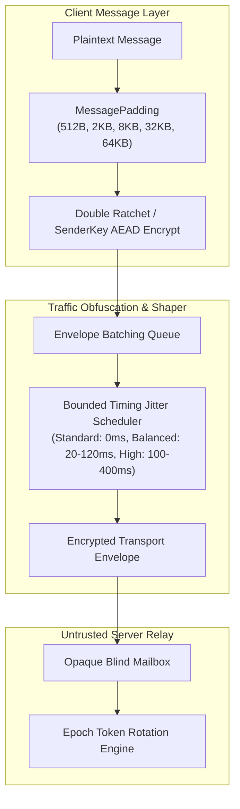

# METADATA_MODEL.md — Metadata Minimization & Traffic Privacy

## 1. The Metadata Problem

In standard centralized messaging platforms, even when message plaintexts are end-to-end encrypted, relay servers and network observers log vast amounts of sensitive communication metadata:
- Who is speaking with whom (Social Graph / Contact Map)
- Exact timestamps and frequency of messages
- Exact message sizes and payload signatures
- User IP addresses and physical device identifiers
- Active typing keystroke intervals and read receipts

**VEIL is engineered to minimize all forms of communication metadata exposed to transport infrastructure and passive network wiretaps.**

---

## 2. Server Knowledge Matrix (Phase 8 Verified Reality)

| Data Field | Server Sees? | Required for Operation? | Reason / Mitigation |
| :--- | :--- | :--- | :--- |
| **Client IP Address** | **Yes** *(in direct mode)* | Yes (TCP/TLS transport) | Inherent to direct TCP connections. Decoupled via `ITransportAdapter` (Tor / Proxy compatible). |
| **Connection Timestamp** | **Yes** | Yes (Transport) | Bounded timing jitter (20ms–400ms) + batching queues reduce exact event correlation. |
| **Destination Mailbox ID** | **Yes** | Yes (Blind delivery) | Opaque 32-byte hex ID. Unlinked to user identities, usernames, or public keys. Rotates periodically. |
| **Capability Verifier** | **Yes** *(SHA-256 hash)* | Yes (Access control) | Server holds `SHA-256(cap || tag)`, never the client-held capability secret. Rotated across epochs. |
| **Payload Ciphertext** | **Yes** *(Opaque blob)* | Yes (Storage & routing) | Ciphertext encrypted with Double Ratchet / Sender Keys. Server cannot decrypt. |
| **Exact Message Size** | **No** *(Padded)* | No | Padded to standardized size buckets (512B, 2KB, 8KB, 32KB, 64KB). |
| **Message Plaintext** | **NO** | Never | Application-layer encryption protects all content. |
| **User Passwords / PINs** | **NO** | Never | Never transmitted over the wire. |
| **Space Master Key (SMK)** | **NO** | Never | Remains sealed in volatile memory on device only. |
| **Private Identity Keys** | **NO** | Never | Ed25519/X25519 private keys never leave the client. |
| **Space Names / Types** | **NO** | Never | Local vault metadata only. |
| **Contact Social Graph** | **NO** | Never | Server maintains zero user accounts or contact relationships. |

---

## 3. Traffic Obfuscation & Privacy Architecture

---

## 4. Size Normalization & Bucket Quantization

To prevent network observers and ISPs from deducing message types or conversation patterns from packet sizes, VEIL enforces **Standard Size Buckets**:

| Size Class / Bucket | Capacity | Typical Usage |
| :--- | :--- | :--- |
| `512 bytes` | 512B | Short text messages, reactions, acknowledgments |
| `2,048 bytes` | 2 KiB | Standard chat messages, group events |
| `8,192 bytes` | 8 KiB | Structured documents, prekey exchange bundles |
| `32,768 bytes` | 32 KiB | Extended metadata, image descriptors |
| `65,536 bytes` | 64 KiB | Encrypted media chunks |

All payloads are padded using deterministic length-prefixed random padding before application-layer transport packaging.
