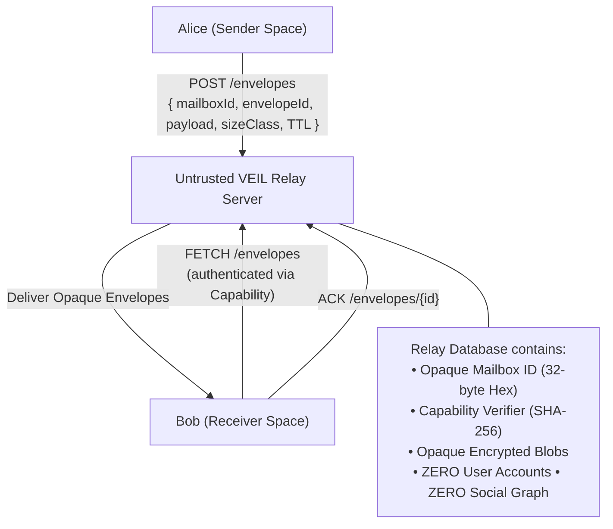

# METADATA_MODEL.md — Metadata Minimization & Traffic Privacy

## 1. The Metadata Problem

In standard centralized messaging platforms, even when message plaintexts are end-to-end encrypted, relay servers log vast amounts of sensitive communication metadata:
- Who is speaking with whom (Social Graph / Contact Map)
- Exact timestamps and frequency of messages
- Exact message sizes and payload signatures
- User IP addresses and physical device identifiers

**VEIL is engineered to minimize all forms of communication metadata exposed to transport infrastructure.**

---

## 2. Server Knowledge Matrix (Phase 3 Verified Reality)

The following table documents exactly what the transport server can and cannot observe in VEIL's Phase 3 implementation:

| Data Field | Server Sees? | Required for Operation? | Reason / Mitigation |
| :--- | :--- | :--- | :--- |
| **Client IP Address** | **Yes** *(in direct mode)* | Yes (TCP/TLS transport) | Inherent to direct TCP connections. Privacy relays / mixnets deferred to future phases. |
| **Connection Timestamp** | **Yes** | Yes (Transport) | Transport timing observable on TCP connect. |
| **Destination Mailbox ID** | **Yes** | Yes (Blind delivery) | Opaque 32-byte hex ID. Unlinked to user identities, usernames, or public keys. |
| **Capability Verifier** | **Yes** *(SHA-256 hash)* | Yes (Access control) | Server holds `SHA-256(cap || tag)`, never the client-held capability secret. |
| **Payload Ciphertext** | **Yes** *(Opaque blob)* | Yes (Storage & routing) | Ciphertext encrypted at application layer. Server cannot decrypt. |
| **Exact Message Size** | **No** *(Padded)* | No | Padded to fixed size classes (512B, 2KB, 8KB, 32KB). |
| **Message Plaintext** | **NO** | Never | Application-layer encryption protects all content. |
| **User Passwords / PINs** | **NO** | Never | Never transmitted over the wire. |
| **Space Master Key (SMK)** | **NO** | Never | Remains sealed in volatile memory on device only. |
| **Private Identity Keys** | **NO** | Never | Ed25519/X25519 private keys never leave the client. |
| **Space Names / Types** | **NO** | Never | Local vault metadata only. |
| **Contact Social Graph** | **NO** | Never | Server maintains no user accounts or contact relationships. |

---

## 3. Blind Mailbox Routing Scheme

VEIL eliminates centralized user identifiers and user-indexed routing tables on the relay server.

### Protocol Mechanics
1. **Opaque Mailbox Identifiers**: Mailboxes are identified by random 32-byte hex strings (`mailboxId`). They are generated randomly using CSPRNG and are unlinked to email, phone numbers, or identity public keys.
2. **Capability-Based Authentication**: Access to fetch or delete envelopes from a mailbox requires a 256-bit random capability secret. The server stores only `SHA-256(capability || "veil-v1-mailbox-auth")`.
3. **Blind Storage**: The server stores messages indexed strictly by `mailboxId`.
4. **Zero Social Graph**: The server cannot correlate which `mailboxId` belongs to which user or determine whether two mailboxes represent communication between the same pair of people.

---

## 4. Size Normalization & Traffic Analysis Mitigation

To prevent network observers and ISPs from deducing message types or conversation patterns from packet sizes, VEIL enforces **Standard Size Classes**:

| Size Class | Total Capacity | Typical Usage |
| :--- | :--- | :--- |
| `SMALL` | **512 bytes** | Text messages, short ACKs, typing heartbeats |
| `MEDIUM` | **2,048 bytes** (2 KiB) | Longer text messages, small metadata envelopes |
| `LARGE` | **8,192 bytes** (8 KiB) | Structured documents, prekey exchange bundles |
| `XLARGE` | **32,768 bytes** (32 KiB) | Encrypted attachment thumbnails, chunks |

All payloads are padded using deterministic length-prefixed random padding before transmission.

---

## 5. Replay Resistance & Deduplication

Every transport envelope carries a random 16-byte `envelopeId`. Local client inboxes maintain an encrypted deduplication registry (`processed_ids`) to reject duplicate transmissions from network retries.
