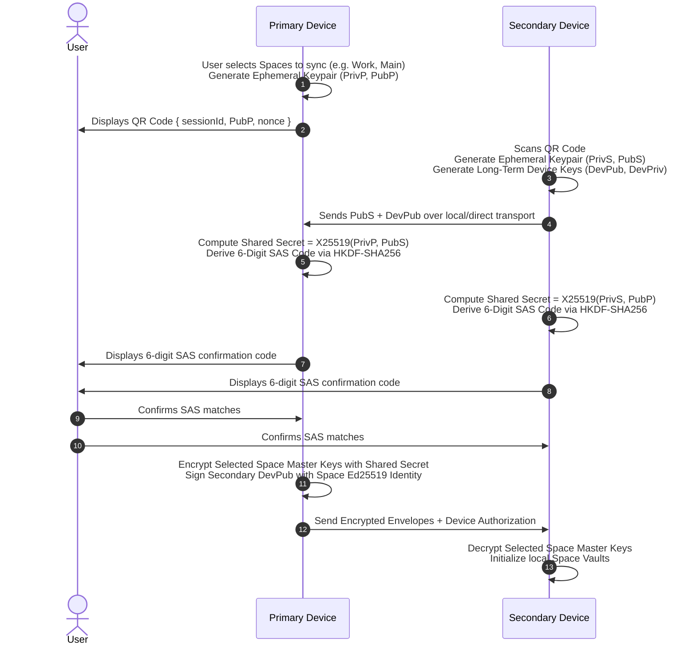

# MULTI_DEVICE.md — VEIL Multi-Device Enrollment & Selective Synchronization

## 1. Executive Summary

VEIL supports multi-device operation while preserving its core security invariant: **Multi-Space Cryptographic Isolation**.
Users can enroll secondary devices (such as a laptop, tablet, or secondary phone) and explicitly select which individual Spaces are synchronized.

---

## 2. Ephemeral Device Enrollment Protocol

---

## 3. Short Authentication String (SAS) Derivation

To prevent active Man-in-the-Middle (MITM) attacks during ephemeral key agreement:
$$\text{SASBytes} = \text{HKDF-SHA256}(\text{ikm}=\text{SharedSecret}, \text{salt}=\text{PubP} \parallel \text{PubS}, \text{info}=\text{"veil-v1-device-sas"}, \text{length}=4)$$
$$\text{SASCode} = (\text{BigEndianUInt32}(\text{SASBytes}) \bmod 1,000,000) \to \text{formatted as 6 digits (e.g., "482910")}$$

Both devices must display the identical 6-digit code. If an adversary intercepts and replaces ephemeral public keys, the computed SAS codes will mismatch, allowing the user to abort immediately before any Space credentials are transmitted.

---

## 4. Selective Space Synchronization

- **Per-Space Scope**: The primary device user explicitly chooses which Space(s) to transfer.
- **Unselected Spaces**: For any unselected Space (such as a Private Space or Decoy Space), zero cryptographic keys, metadata, or envelopes are transferred. The secondary device remains completely unaware of their existence.
- **Independent Space Passwords**: The secondary device can set a new local password or unlock credential for the imported Space.

---

## 5. Device Revocation & Post-Revocation Security

1. **Signed Revocation Tombstones**: An authorized device can revoke any secondary device by signing a `RevocationRecord` with the Space's Ed25519 identity key.
2. **Key & Prekey Pool Rotation**: Upon device revocation, remaining active devices rotate local prekey pools and ratchet states.
3. **Exclusion from Future Fan-out**: Revoked device IDs are removed from the active `DeviceRegistry` and will not receive future sync envelopes or multi-device messages.
