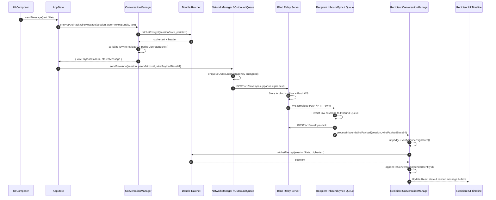

# VEIL — Phase 24: Comprehensive Message Lifecycle & Boundary Audit

## 1. Executive Summary
This document traces and formalizes the 12-boundary journey of an encrypted message in VEIL, from user input in the React UI through the Double Ratchet engine, discrete size padding, untrusted relay envelope transport, ACK-after-persistence, and decryption into the recipient UI timeline.

---

## 2. The 12 Lifecycle Boundaries

---

## 3. Boundary Audit Matrix

| Boundary | Function | Input Data Structure | Output Data Structure | Key Invariant |
| :--- | :--- | :--- | :--- | :--- |
| **1. UI Composer** | `MessageComposer.handleSubmit` | React state `text` / `File` | `sendMessage(text)` | Non-empty input validation |
| **2. AppState** | `AppState.sendMessage` | `activeChatId`, `text` | Calls `convMgr` & `networkMgr` | Resolves contact & mailbox ID |
| **3. Conversation Manager** | `encryptAndPackWireMessage` | `SpaceSession`, `PrekeyBundle`, `text` | `{ wirePayloadBase64, storedMessage }` | Cryptographic signature of sender |
| **4. Double Ratchet** | `ratchetEncrypt` | `RatchetSession`, `plaintext` | `RatchetMessage` (DH pubkey, N, PN, ciphertext) | Forward secrecy & break-in recovery |
| **5. Wire Serialization & Padding** | `packWireMessage` | `WirePayload` | Discrete padded buffer | Metadata traffic analysis resistance |
| **6. Outbound Queue** | `NetworkManager.sendEnvelope` | `SpaceSession`, `targetMailboxId`, payload | Enqueued `QueueItem` | Crash-safe storage before network |
| **7. Blind Relay Transport** | `HTTP / WebSocket` | `POST /v1/envelopes` | HTTP 200 `{ envelopeId }` | Zero plaintext, zero sender metadata |
| **8. Recipient Inbound Sync** | `NetworkManager.syncMailbox` | `/v1/mailboxes/:id/envelopes` | Envelopes array | Batched retrieval |
| **9. ACK-after-Persistence** | `processInboundEnvelope` | Inbound envelope | Local write, then `/v1/envelopes/ack` | No message loss upon crash |
| **10. Inbound Wire Processing** | `processInboundWirePayload` | `wirePayloadBase64` | `ProcessInboundResult` | Ed25519 signature verification |
| **11. Ratchet Decryption** | `ratchetDecrypt` | `RatchetMessage` | `plaintext` bytes | Cryptographic integrity verification |
| **12. Timeline Rendering** | `ConversationView.render` | React state `messages[peerIdentityId]` | JSX message bubble | Distinct delivery checkmarks |
