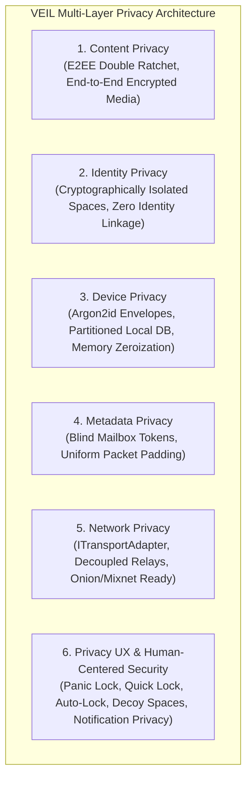

# PRIVACY.md — Multi-Layer Privacy Architecture

Privacy is not a single binary attribute; it is a multi-dimensional engineering problem. VEIL defines and addresses privacy across five distinct architectural layers and a human-centered privacy UX.

---

## 1. The Five Privacy Layers

---

## 2. Layer-by-Layer Specifications

### Layer 1: Content Privacy
- **Protection Scope**: Message plaintexts, audio recordings, images, video attachments, document files.
- **Guarantee**: Protected end-to-end between communicating clients using Double Ratchet and Sender Keys (`XChaCha20-Poly1305`, Ed25519, X25519).
- **Server Visibility**: Zero. The server never holds or receives decryption keys.

### Layer 2: Identity Privacy
- **Protection Scope**: Relationships between different Spaces on the same device.
- **Guarantee**: Each Space generates independent cryptographic keys. External contacts and relay servers cannot link Identity A (Main Space) to Identity B (Private Space).

### Layer 3: Device & Local Storage Privacy
- **Protection Scope**: Data stored locally on the user's physical device.
- **Guarantee**: All local databases and keys are sealed inside Argon2id-derived encrypted envelopes. When locked, data is unreadable ciphertext. Memory buffers are zeroized upon lock or panic trigger.

### Layer 4: Metadata Privacy
- **Protection Scope**: Communication social graphs and payload sizes.
- **Guarantee**: Messages route through opaque blind mailboxes (`mailboxId`). Envelopes are size-normalized into standard classes (512B, 2KB, 8KB, 32KB) with random padding. The server maintains zero social graph or user registry.

### Layer 5: Network Privacy & Transport Decoupling
- **Protection Scope**: Network routing paths and network address decoupling.
- **Guarantee**: Transport logic is decoupled through `ITransportAdapter`. In direct TLS mode, the server observes the client's network address (IP); transport over onion routing or privacy proxies is supported via adapter configuration.

### Layer 6: Privacy UX & Human-Centered Security
- **Credential-Selected Unlock**: Zero Space disclosure before authentication; generic unlock error (`"Unable to unlock."`) for all failures.
- **Quick Lock vs Panic Lock**: Normal single-space lock vs instant multi-space memory wipe and sensitive UI purge.
- **Configurable Auto-Lock**: Automatic inactivity timer (1m, 5m, 15m, 30m, on background).
- **Notification Privacy Tiers**: High (zero content/sender), Balanced (sender only), Convenient (preview).
- **Locked-State UI Purge**: Messages, media previews, drafts, and search caches are wiped on lock.

---

## 3. Cryptographic Honesty & Explicit Limitations

VEIL strictly avoids misleading marketing slogans such as "100% untraceable", "military-grade", "unhackable", or "absolute anonymity."
- **Content Encryption**: Protects message content from the transport infrastructure.
- **IP Address Exposure**: Direct client-to-server TLS connections inherently expose the client's IP address to the server.
- **Timing & Volume**: While size classes conceal exact message lengths, communication timing and message frequency remain observable to network observers without additional mixnet/delay layers.
- **Host Device Security**: Security guarantees depend on the integrity of the host operating system.
