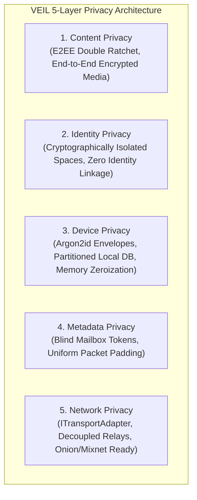

# PRIVACY.md — Multi-Layer Privacy Architecture

Privacy is not a single binary attribute; it is a multi-dimensional engineering problem. VEIL defines and addresses privacy across five distinct architectural layers.

---

## 1. The Five Privacy Layers

---

## 2. Layer-by-Layer Specifications

### Layer 1: Content Privacy
- **Protection Scope**: Message plaintexts, audio recordings, images, video attachments, document files.
- **Guarantee**: Protected end-to-end between communicating clients using the Double Ratchet algorithm (X25519, HKDF, XChaCha20-Poly1305 / AES-256-GCM).
- **Server Visibility**: Zero. The server never holds or receives decryption keys.

### Layer 2: Identity Privacy
- **Protection Scope**: Relationships between different Spaces on the same device.
- **Guarantee**: Each Space generates independent cryptographic keys. External contacts and relay servers cannot link Identity A (Main Space) to Identity B (Private Space).

### Layer 3: Device & Local Storage Privacy
- **Protection Scope**: Data stored locally on the user's physical device.
- **Guarantee**: All local databases and keys are sealed inside Argon2id-derived encrypted envelopes. When locked, data is unreadable ciphertext. Memory buffers are zeroized upon lock or panic trigger.

### Layer 4: Metadata Privacy
- **Protection Scope**: Communication social graphs, traffic frequency, and packet sizes.
- **Guarantee**: Messages route through blind mailbox tokens (`HMAC-SHA256`). Plaintexts are padded to fixed-size blocks to prevent traffic analysis.

### Layer 5: Network Privacy
- **Protection Scope**: IP addresses, ISP tracking, network routing paths.
- **Guarantee**: Transport logic is abstracted through `ITransportAdapter`. The client can route traffic over TLS WebSockets, Tor onion services, or mixnet proxies without changing the application core.

---

## 3. Privacy Claims & Honesty

VEIL strictly avoids misleading marketing slogans such as "100% untraceable" or "military-grade absolute anonymity." All privacy guarantees are explicitly tied to verifiable cryptographic primitives and their documented threat boundaries.
