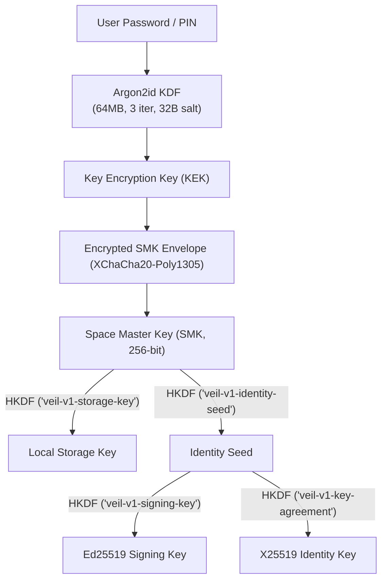

# SECURITY_GUIDE.md — Technical Security & Cryptographic Architecture Guide

## 1. Overview

VEIL is an open, privacy-first messaging system engineered for multi-space cryptographic isolation, untrusted relay transport, and metadata minimization. This guide provides a technical overview of VEIL's cryptographic design and security boundaries for developers, operators, and external auditors.

---

## 2. Core Cryptographic Primitives

VEIL relies strictly on mature, widely audited, standard primitives from the `@noble` suite:

| Layer / Purpose | Cryptographic Algorithm | Library & Specification | Key / Nonce Size |
| :--- | :--- | :--- | :--- |
| **Password KDF** | `Argon2id` | `@noble/hashes/argon2` (RFC 9106) | 32-byte salt, 64 MiB memory, 3 iterations |
| **Authenticated AEAD** | `XChaCha20-Poly1305` | `@noble/ciphers/chacha` (RFC 8439 / draft-arciszewski) | 256-bit key, 192-bit (24-byte) CSPRNG nonce |
| **Key Agreement** | `X25519` (Diffie-Hellman) | `@noble/curves/ed25519` (RFC 7748) | 256-bit curve points |
| **Digital Signatures** | `Ed25519` | `@noble/curves/ed25519` (RFC 8032) | 256-bit public keys, 512-bit signatures |
| **Key Derivation** | `HKDF-SHA256` | `@noble/hashes/hkdf` (RFC 5869) | 256-bit digest with domain separation tags |
| **Space Recovery** | `BIP-39` (24 Words) | Client-side 256-bit entropy + 8-bit SHA-256 checksum | 264-bit mnemonic array |

---

## 3. Cryptographic Key Hierarchy

---

## 4. Multi-Space Cryptographic Isolation

- **Independent Master Keys**: Every Space (Main, Private, Decoy) derives its own distinct `SpaceMasterKey` (SMK) from an independent 32-byte salt using `Argon2id`.
- **Zero Cross-Space Leakage**: Storage partitions, contact keys, Double Ratchet sessions, and search indexes are encrypted under the respective Space's derived `StorageKey`.
- **Decoy Spaces**: Authentic encrypted Spaces with full functional capabilities; identical on-disk and in-memory structures to prevent cryptographic differentiation.

---

## 5. End-to-End Encryption & Group Protocols

1. **1-to-1 Messaging (Double Ratchet)**:
   - Initial key exchange via X3DH (`IdentityKey`, `SignedPrekey`, `OneTimePrekey`).
   - Symmetrically ratcheted per-message keys + asymmetric DH ratchet per roundtrip.
   - Provides Forward Secrecy and Post-Compromise Self-Healing.
2. **Group Messaging (Sender Keys)**:
   - Monotonically increasing epochs (`GroupState`).
   - Group actions (member addition/removal, role changes) signed by admin Ed25519 identity.
   - Immediate Sender Key rotation upon member departure guaranteeing Forward Secrecy.
3. **Encrypted Media**:
   - Split into fixed 64 KiB chunks.
   - Each chunk encrypted under `XChaCha20-Poly1305` with chunk index authenticated in AAD.

---

## 6. Blind Mailbox Transport & Metadata Minimization

- **Untrusted Relay Model**: The server is a blind mailbox store. It sees zero user accounts, zero phone numbers, and zero social graphs.
- **Capability Access**: Fetching and deleting messages requires a 256-bit capability secret; the server stores only `SHA-256(cap || "veil-v1-mailbox-auth")`.
- **Traffic Analysis Defenses**:
  - Size bucket quantization (`512B`, `2KB`, `8KB`, `32KB`, `64KB`).
  - Bounded timing jitter (20ms–400ms).
  - Outbox batching queues.
  - Periodic mailbox capability epoch rotation.

---

## 7. Emergency Panic Lock & Memory Containment

- `LockManager.panicLock()` immediately destroys all active `SpaceSession` objects across all Spaces.
- Volatile memory zeroization (`zeroize`) is called on all private keys, SMKs, and chain keys.
- UI sensitive state (plaintexts, drafts, cached search results) is purged immediately.
