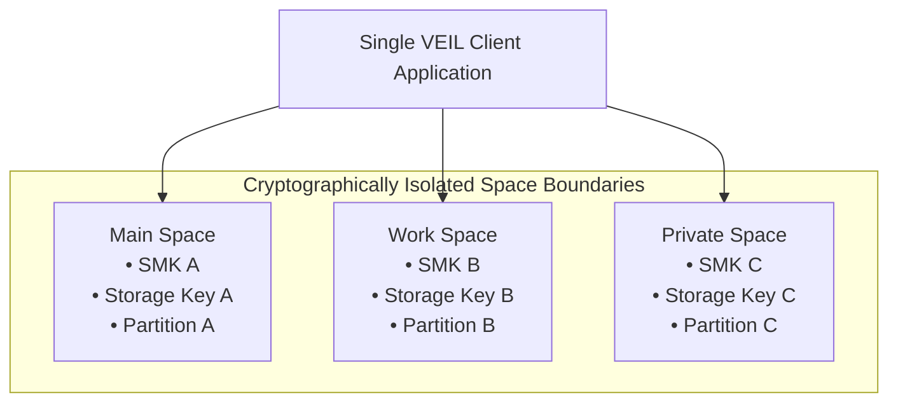

# SPACE_MODEL.md — Multi-Space Architecture & Isolation Model

## 1. Concept & Rationale

VEIL's signature capability is the **Multi-Space Model**.

A single client device can contain multiple **Spaces** (e.g. Main Space, Work Space, Private Space, optional Decoy Space).

Spaces are **not** mere UI profile switches. Each Space is a cryptographically isolated vault containing its own:
- Encryption Keys & Storage Key (`StorageKey = HKDF(SMK, "veil-v1-storage-key")`)
- Future Cryptographic Identity (Phase 2)
- Contact Lists & Conversations
- Cached Media & Attachments
- Privacy & Notification Configurations

---

## 2. Space Discovery in Phase 1

### Local Credential Discovery & Optimization
- **Targeted Unlock**: When a user selects a specific Space from the local switcher or unlock prompt, VEIL performs targeted single-envelope unlock:
  `vault.unlockSpace(password, spaceId)`
  This runs exactly **1** Argon2id operation ($O(1)$).
- **Candidate Scan Unlock**: `vault.unlockSpace(password)` allows scanning local envelopes.
- **Phase 1 Limitation Disclosure**: In Phase 1, the `spaceId` and Space names in envelopes are stored as local metadata. This is a local prototype discovery mechanism and is **NOT** an anonymous discovery mechanism. Anonymous credential-blind discovery belongs to later phases.

---

## 3. Authenticated Envelope Context Binding (AAD)

Every Space Master Key (SMK) is sealed with an explicit Authenticated Associated Data (AAD) string:
$$\text{AAD} = \text{"VEIL-v1|version:1|spaceId:"} \parallel \text{spaceId} \parallel \text{"|alg:XChaCha20-Poly1305|salt:"} \parallel \text{salt}$$

This guarantees that:
1. Ciphertext cannot be moved to another Space.
2. Space metadata (version, salt, spaceId) cannot be altered without failing authentication.

---

## 4. Transactional, Crash-Safe Password Change

Password change in VEIL is crash-safe and transactional:
1. Recovers existing SMK using old password and old AAD.
2. Derives new KEK under new password with fresh random 32-byte salt.
3. Encrypts existing SMK with new KEK, fresh nonce, and new AAD into a candidate envelope.
4. Pre-validates candidate envelope structure.
5. Atomically commits the new envelope to storage.
6. If any step fails or is interrupted prior to atomic commit, the original envelope remains 100% intact and uncorrupted.

---

## 5. Space Deletion & Forensics

`deleteSpace(spaceId)` executes:
- Session destruction and key memory zeroization.
- Removal of the encrypted envelope from local storage.
- Purging of the encrypted storage partition.

**Forensic Limitations**: Modern flash storage and solid-state drives employ wear-leveling controllers where erased blocks may physically retain residual data until trimmed or overwritten. VEIL relies on cryptographic destruction (unrecoverability of the KEK/SMK) rather than unrealistic physical storage erasure claims.
