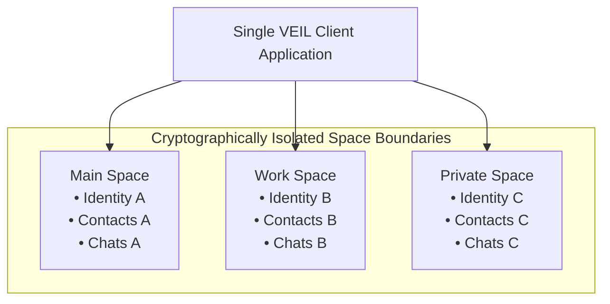
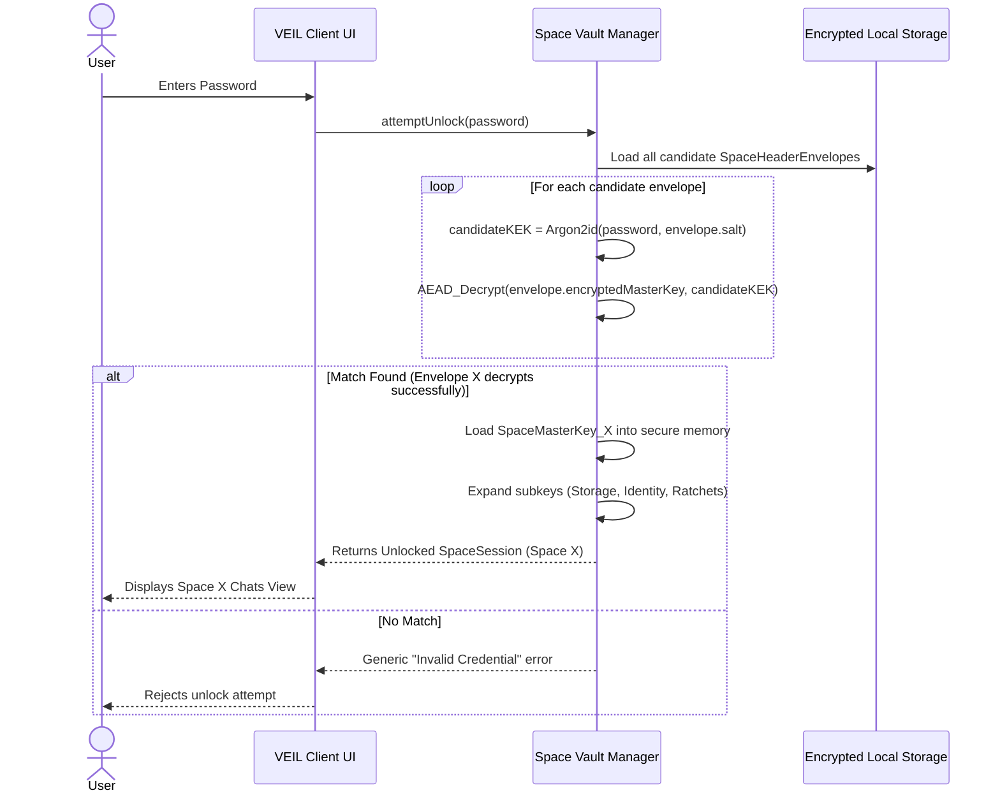

# SPACE_MODEL.md — Multi-Space Architecture & Isolation Model

## 1. Concept & Rationale

VEIL's signature capability is the **Multi-Space Model**.

A single client device can contain multiple **Spaces** (e.g. Main Space, Work Space, Private Space, optional Decoy Space).

Spaces are **not** mere UI profile switches. Each Space is a cryptographically isolated vault containing its own:
- Cryptographic Identity (Ed25519 & X25519)
- Encryption Keys & Ratchet States
- Contact Lists
- Conversation Histories & Groups
- Cached Media & Attachments
- Privacy & Notification Configurations

---

## 2. Credential-Selected Unlocking

The user unlocks VEIL using a single password input. The specific password entered deterministically determines which Space is unlocked.

---

## 3. Cryptographic Space Isolation Guarantees

1. **No Shared Root Secret**: Unlocking Space A yields `SMK_A`. It provides zero mathematical ability to decrypt Space B or Space C.
2. **Independent Databases**: Local database records are encrypted with `StorageKey = HKDF(SMK)`. Since `SMK_B` remains encrypted under Space B's KEK, Space B records cannot be read by Space A.
3. **Decoy Space Coercion Resistance**: If an emergency decoy password is entered, VEIL unlocks the Decoy Space seamlessly without prompting or indicating the presence of other protected Spaces.
4. **Panic Lock Memory Zeroing**: Triggering Panic Lock immediately wipes all active SMK and subkey memory buffers and returns to the locked screen.
