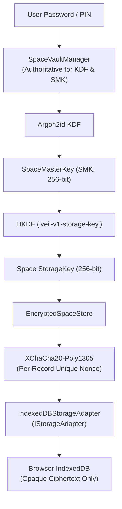

# STORAGE_ARCHITECTURE.md — Persistent Local Storage Architecture & Security Model

## 1. Overview & Purpose

VEIL's local storage subsystem provides **plaintext persistence protection** for multi-Space header envelopes, contacts, cryptographic ratchets, group states, and encrypted messages.

It ensures that when VEIL writes data to browser storage (`IndexedDB`), all sensitive application state is transformed into authenticated AEAD ciphertext (`XChaCha20-Poly1305`) keyed by the active Space's derived `StorageKey`.

---

## 2. Storage Topology & Object Stores

VEIL uses a structured, versioned IndexedDB database (`veil_encrypted_vault`) containing three dedicated object stores:

```
Database: veil_encrypted_vault (Schema Version: 1)
│
├── [Store] envelopes (keyPath: spaceId)
│   └── SpaceHeaderEnvelope (Ciphertext SMK, salt, Argon2id parameters, AAD metadata)
│
├── [Store] records (keyPath: [spaceId, key], Index: by_spaceId)
│   └── StoredRecord ({ spaceId, key, nonce, ciphertext, updatedAt })
│
└── [Store] meta (keyPath: key)
    └── StorageMetadata ({ schemaVersion, lastMigratedAt, initializedAt })
```

---

## 3. Cryptographic Keying & Layer Boundaries



### Separation of Concerns:
1. **`SpaceVaultManager`**: Remains the sole authoritative subsystem for password handling, Argon2id KDF derivations, KEK wrapping/unwrapping, session creation, and key zeroization.
2. **`EncryptedSpaceStore`**: Encrypts and decrypts application data under the active Space's `StorageKey`.
3. **`IndexedDBStorageAdapter`**: Provides persistent I/O over browser `IndexedDB`.

---

## 4. Fail-Closed Error Model

In production environments, VEIL enforces strict **fail-closed** behavior:
- If `indexedDB` is blocked, unsupported, or fails to initialize, VEIL throws `StorageUnavailableError` and halts storage operations.
- VEIL **never silently falls back** to volatile memory in production, preventing unexpected data loss upon tab closure.
- `MemoryStorageAdapter` is strictly restricted to automated unit test suites and explicitly configured test harnesses.

---

## 5. Threat Model, Scope & Physical Storage Boundaries

### What Plaintext Persistence Protection Guarantees:
- **At-Rest Protection**: An adversary obtaining an offline copy of the browser's IndexedDB database file (e.g. SQLite `.indexeddb` file on disk) cannot read message plaintexts, private keys, passwords, or the Space Master Key without deriving the KEK via Argon2id.
- **Cross-Space Isolation on Disk**: Each Space's records are encrypted under that specific Space's unique `StorageKey`. Even if Space A's password is known, Space B's records in the same IndexedDB database remain unreadable.
- **Tampering & Bit-Flipping Detection**: Any modification to ciphertexts or nonces on disk triggers AEAD authentication tag validation failure upon read, safely failing closed with an error.

### Explicit Limitations (Honest Security Boundaries):
1. **No "Zero-Knowledge Disk Guarantee"**: VEIL does not claim absolute zero-knowledge disk isolation against kernel or hardware compromise.
2. **No Physical Deletion Guarantee**: Modern SSDs, Flash controllers, and browser IndexedDB implementations perform wear leveling, journal commits, and log compaction. Deleting a record from IndexedDB notifies the database engine to mark the slot free, but the software cannot force an immediate physical overwrite of underlying NAND flash blocks.
3. **Compromised Host OS / Keyloggers**: If malicious software or spyware compromises the host machine, it can read memory buffers while a Space is unlocked.
4. **Browser Runtime Security**: The security of IndexedDB relies on the security of the host browser's origin sandbox and operating system permissions.
