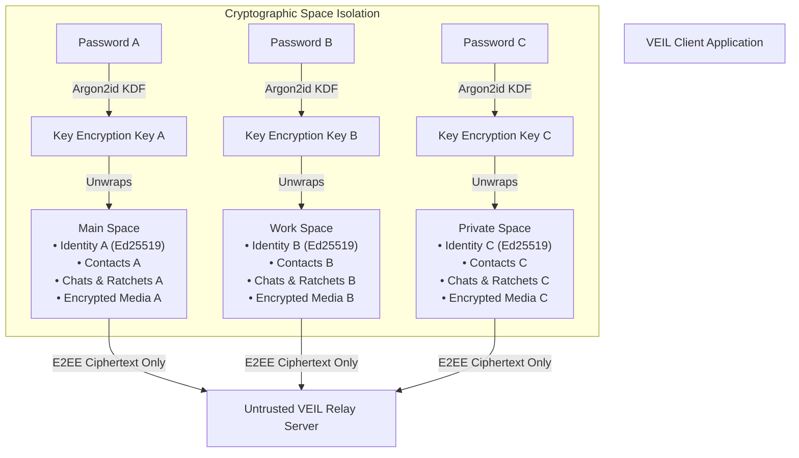

# PROJECT_CONTEXT.md — VEIL Project Overview & Architecture

## 1. Project Vision

**VEIL** is a modern, privacy-first messaging application designed to provide the sleek, intuitive user experience of mainstream messengers (such as Signal/Telegram) combined with a groundbreaking security capability:

> **Multi-Space Cryptographic Architecture**: A single VEIL client instance can host multiple, completely isolated **Spaces** (e.g. Main Space, Work Space, Private Space, optional Decoy Space), where each Space is unlocked by a different credential and operates with completely independent cryptographic identities, keys, contacts, conversations, media, and privacy configurations.

One Space has zero mathematical or logical visibility into another Space. To an untrusted relay server or an external contact, there is no linkage between identities across different Spaces.

---

## 2. Core Product Principles

### "Hide the complexity, not the capability."
- **To the ordinary user**: "This is a lightning-fast, beautiful, intuitive messaging app."
- **To the security engineer**: "This is a mathematically rigorous, zero-trust, end-to-end encrypted multi-vault communication system."
- Cryptographic jargon is kept strictly under the hood. The user interface remains familiar, clean, and accessible.

---

## 3. Terminology Matrix

| Internal / Cryptographic Term | User-Facing Product Term | Notes |
| :--- | :--- | :--- |
| Persona / Vault | **Space** (e.g. Main Space, Private Space) | Logical & cryptographic boundary |
| Encrypted Space Envelope | **Protected Space** | AES-256-GCM / XChaCha20-Poly1305 wrapped storage |
| Cryptographic Identity | **Profile / Identity** | Ed25519 public key & signing pair |
| Master Key / Key Material | **Security Credentials** | Derived via Argon2id from user password |
| Relay Node / Blind Transport | *(Invisible to normal user)* | Untrusted message routing abstraction |
| Decoy Vault | **Decoy Space** | Plausible deniability (with explicit documented limits) |

---

## 4. Key Architectural Differentiators

1. **Independent Cryptographic Identities**: Each Space generates its own unique Ed25519 (signing) and X25519 (key agreement) keypairs. The server sees distinct public keys with zero correlation.
2. **Credential-Selected Unlocking**: Entering a password computes an Argon2id hash used to attempt decryption of local Space key envelopes. Only the envelope matching the derived key can open; locked Spaces remain impenetrable ciphertext.
3. **Untrusted Server Model**: The relay server never sees plaintexts, user passwords, private keys, contact graphs, or cross-space associations.
4. **Zero Paid Services**: The development ecosystem is 100% open-source, local-first, and container/runtime agnostic.

---

## 5. Technology Stack

- **Language & Runtime**: TypeScript 5.x, Node.js 20+ (ES Modules)
- **Frontend / Client UI**: React 19, Vite, Vanilla CSS Design System (no Tailwind dependency, sleek dark mode, glassmorphic tokens)
- **Cryptographic Primitives**: 
  - Password KDF: Argon2id (`argon2-browser` / `@noble/hashes`)
  - Authenticated Encryption: XChaCha20-Poly1305 & AES-256-GCM
  - Key Exchange & Signatures: `@noble/curves` (Ed25519, X25519)
  - Messaging Protocol: Double Ratchet algorithm with prekey bundles
- **Relay Transport**: WebSocket / HTTP message store with blind routing tokens
- **Testing & Verification**: Vitest (Unit, Negative/Adversarial, Space Isolation, Integration)

---

## 6. Document Map & Reference Links

- Root Agent Contract: [`AGENTS.md`](file:///c:/Users/RTX%204060/Desktop/PROJECT/chat/AGENTS.md)
- Current State: [`docs/ai/CURRENT_STATE.md`](file:///c:/Users/RTX%204060/Desktop/PROJECT/chat/docs/ai/CURRENT_STATE.md)
- Active Task: [`docs/ai/ACTIVE_TASK.md`](file:///c:/Users/RTX%204060/Desktop/PROJECT/chat/docs/ai/ACTIVE_TASK.md)
- Decisions (ADRs): [`docs/ai/DECISIONS.md`](file:///c:/Users/RTX%204060/Desktop/PROJECT/chat/docs/ai/DECISIONS.md)
- Security Rules: [`docs/ai/SECURITY_RULES.md`](file:///c:/Users/RTX%204060/Desktop/PROJECT/chat/docs/ai/SECURITY_RULES.md)
- Changelog: [`docs/ai/CHANGELOG.md`](file:///c:/Users/RTX%204060/Desktop/PROJECT/chat/docs/ai/CHANGELOG.md)
- Architecture Specifications:
  - System Overview: [`docs/architecture/ARCHITECTURE.md`](file:///c:/Users/RTX%204060/Desktop/PROJECT/chat/docs/architecture/ARCHITECTURE.md)
  - Space Architecture: [`docs/architecture/SPACE_ARCHITECTURE.md`](file:///c:/Users/RTX%204060/Desktop/PROJECT/chat/docs/architecture/SPACE_ARCHITECTURE.md)
  - Key Hierarchy: [`docs/architecture/KEY_HIERARCHY.md`](file:///c:/Users/RTX%204060/Desktop/PROJECT/chat/docs/architecture/KEY_HIERARCHY.md)
  - Identity & Transport: [`docs/architecture/IDENTITY_AND_TRANSPORT.md`](file:///c:/Users/RTX%204060/Desktop/PROJECT/chat/docs/architecture/IDENTITY_AND_TRANSPORT.md)
  - Threat Model: [`docs/architecture/THREAT_MODEL.md`](file:///c:/Users/RTX%204060/Desktop/PROJECT/chat/docs/architecture/THREAT_MODEL.md)
  - UX Design System: [`docs/architecture/UX_DESIGN_SYSTEM.md`](file:///c:/Users/RTX%204060/Desktop/PROJECT/chat/docs/architecture/UX_DESIGN_SYSTEM.md)
