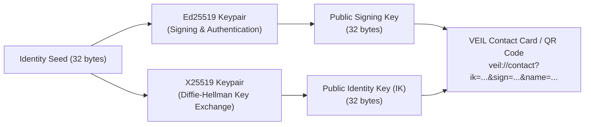
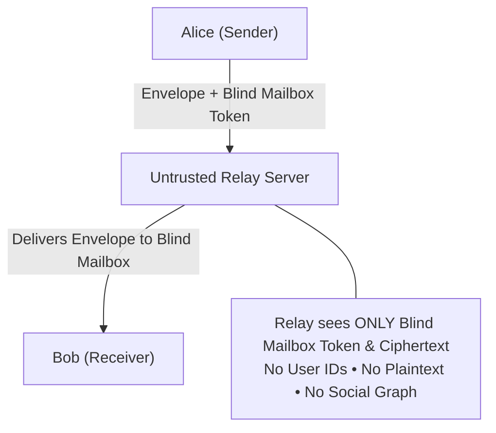

# IDENTITY_AND_TRANSPORT.md — Cryptographic Identity & Transport Abstraction

## 1. Space Cryptographic Identity

Each Space possesses an independent, self-sovereign cryptographic identity that has zero linkage to other Spaces on the same device.



### Identity Structure

```typescript
interface SpaceIdentity {
  /** Space local identifier */
  spaceId: string;
  
  /** Long-term Public Identity Key (X25519) - 32 bytes base64 */
  identityKeyPub: string;
  
  /** Long-term Private Identity Key (X25519) - 32 bytes base64 (RAM only) */
  identityKeyPriv: string;
  
  /** Long-term Public Signing Key (Ed25519) - 32 bytes base64 */
  signingKeyPub: string;
  
  /** Long-term Private Signing Key (Ed25519) - 32 bytes base64 (RAM only) */
  signingKeyPriv: string;
  
  /** User-configured profile display name for this Space */
  displayName: string;
  
  /** User-configured avatar or avatar color hash */
  avatarUrl?: string;
  
  /** Timestamp of identity creation */
  createdAt: number;
}
```

### Safety Numbers (Fingerprint Verification)
- Derived as `SHA-256(Sorted(Alice_IK_Pub, Bob_IK_Pub))`.
- Displayed to users as a 12-digit grouped verification number (e.g. `4829 1059 3820`) or a visual QR code for out-of-band verification against Man-in-the-Middle (MitM) attacks.

---

## 2. Transport Layer Abstraction

To ensure VEIL is not tightly coupled to a single networking protocol or server vendor, all network operations pass through the `ITransportAdapter` interface.

```typescript
export interface TransportMessageEnvelope {
  /** Blind mailbox routing token (unlinked to public identity key) */
  mailboxToken: string;
  
  /** Ephemeral message identifier */
  messageId: string;
  
  /** Encrypted Double Ratchet payload (base64) */
  encryptedPayload: string;
  
  /** Ephemeral sender public key or ratchet header */
  header: {
    dhRatchetPub: string;  // Ephemeral X25519 key (32 bytes base64)
    sequenceNum: number;   // Message sequence number
    prevChainLength: number;
  };
  
  /** Unix timestamp at submission */
  timestamp: number;
}

export interface ITransportAdapter {
  /** Connect to the transport network */
  connect(): Promise<void>;
  
  /** Disconnect from the transport network */
  disconnect(): Promise<void>;
  
  /** Register or poll for incoming messages in a blind mailbox */
  subscribeMailbox(
    mailboxToken: string, 
    onMessage: (envelope: TransportMessageEnvelope) => void
  ): () => void;
  
  /** Send an encrypted message envelope to a recipient mailbox */
  sendMessage(envelope: TransportMessageEnvelope): Promise<{ success: boolean }>;
  
  /** Upload an encrypted media blob */
  uploadEncryptedBlob(ciphertext: Uint8Array): Promise<{ blobId: string; url: string }>;
  
  /** Download an encrypted media blob */
  downloadEncryptedBlob(blobId: string): Promise<Uint8Array>;
}
```

---

## 3. Blind Mailbox Routing Scheme

To protect metadata privacy and prevent the untrusted relay server from compiling communication social graphs:

1. When Alice establishes a conversation with Bob, they derive a shared secret `SessionToken`.
2. For each message transaction, the destination mailbox token is calculated as:
   $$\text{MailboxToken} = \text{HMAC-SHA256}(\text{Bob's Public Prekey}, \text{Current Ratchet Step ID})$$
3. Alice transmits the envelope to `POST /messages/send` addressed to `MailboxToken`.
4. The relay server routes the envelope to the active WebSocket listener subscribed to that `MailboxToken`.
5. The relay server cannot determine:
   - Who Alice is.
   - Who Bob is in real life.
   - Whether Bob is communicating with Alice or five other parties.
   - What the message contents are.



---

## 4. Multi-Transport Extensibility

The `ITransportAdapter` enables multiple interchangeable backends:
1. **`WebSocketRelayAdapter`**: Default low-latency local or hosted untrusted WebSocket relay server.
2. **`MockLocalTransportAdapter`**: In-memory transport for deterministic automated testing and multi-client simulation.
3. **`TorOrMixnetAdapter`**: Future high-latency anonymity transport adapter for enhanced metadata privacy.
