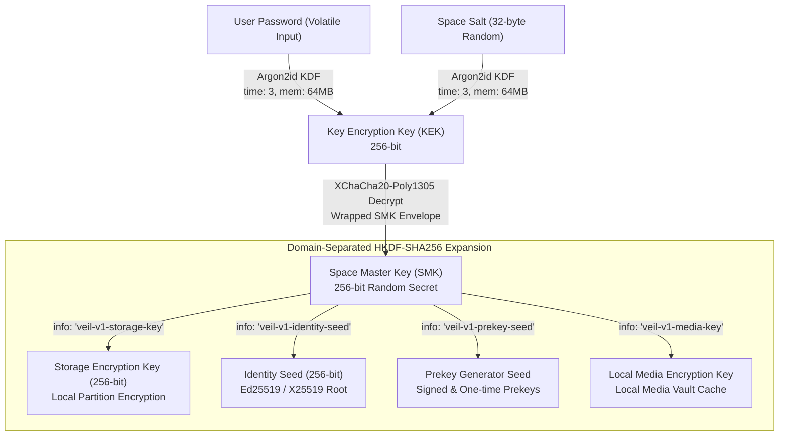

# KEY_HIERARCHY.md — Cryptographic Key Hierarchy & Derivation

## 1. Key Hierarchy Tree

All keys within VEIL originate from a clean, domain-separated cryptographic hierarchy.



---

## 2. Key Specifications & Parameter Definitions

### 1. Key Encryption Key (KEK)
- **Source**: User password + Space Salt (32 bytes).
- **Algorithm**: `Argon2id` (RFC 9106).
- **Parameters**:
  - Memory cost: $65,536\text{ KiB}$ ($64\text{ MiB}$).
  - Time cost: $3\text{ iterations}$.
  - Parallelism: $1\text{ thread}$.
  - Hash length: $32\text{ bytes}$ ($256\text{ bits}$).
- **Role**: Symmetrically decrypts/encrypts the Space Master Key (SMK) inside the `SpaceHeaderEnvelope`.

### 2. Space Master Key (SMK)
- **Source**: Cryptographically secure random 256-bit value (`crypto.getRandomValues(new Uint8Array(32))`).
- **Role**: The permanent root cryptographic key for a specific Space.
- **Lifecycle**: Stored only in encrypted form on disk; exists as a `Uint8Array` in volatile memory only while the Space is unlocked. Zeroized on lock.

### 3. Derived Subkeys (Domain-Separated HKDF-SHA256)
All subkeys are derived using `HKDF-Expand(PRK = SMK, info = DomainTag, L = 32)`:

| Key Name | Domain Tag (`info`) | Length | Purpose |
| :--- | :--- | :--- | :--- |
| `StorageKey` | `"veil-v1-storage-key"` | 32 bytes | Encrypts and authenticates local Space database records (chats, contacts, settings). |
| `IdentitySeed` | `"veil-v1-identity-seed"` | 32 bytes | Deterministically seeds the Space's long-term Ed25519 signing keypair and X25519 identity key. |
| `PrekeySeed` | `"veil-v1-prekey-seed"` | 32 bytes | Derives signed prekeys and one-time prekeys for initial Double Ratchet key exchange. |
| `MediaKey` | `"veil-v1-media-key"` | 32 bytes | Encrypts local cached media attachments on disk. |

---

## 3. Password Change Protocol (Envelope Rewrapping)

Because storage records and identity keys are derived from the permanent `SMK`, changing a Space password does **not** require re-encrypting message histories or media files:

1. User enters current password (verifies KEK and unseals `SMK`).
2. User enters new password.
3. Client generates a fresh random 32-byte `newSalt`.
4. Derives `newKEK = Argon2id(newPassword, newSalt, params)`.
5. Encrypts the existing `SMK` under `newKEK` with a fresh 24-byte nonce.
6. Atomically updates the `SpaceHeaderEnvelope` on disk.
7. Zeroizes `newKEK` and old key buffers.

---

## 4. Double Ratchet Session Keys

For end-to-end communication with external contacts, each conversation maintains an independent **Double Ratchet State**:
- **Root Key (RK)**: 32 bytes, updated on every Diffie-Hellman ratchet step.
- **Chain Keys (CKs / CKr)**: 32 bytes, ratcheted forward symmetrically per message sent or received.
- **Message Keys (MK)**: 32 bytes, derived per message via HMAC-SHA256 and deleted immediately after message encryption/decryption (guaranteeing Forward Secrecy).

---

## 5. Memory Zeroization Standard

Every key object implements a strict disposal pattern:

```typescript
export function zeroize(buffer: Uint8Array): void {
  if (buffer && buffer.length > 0) {
    buffer.fill(0);
  }
}
```

Whenever a `SpaceSession`, `RatchetSession`, or ephemeral buffer is destroyed, `zeroize()` is invoked across all internal buffers.
