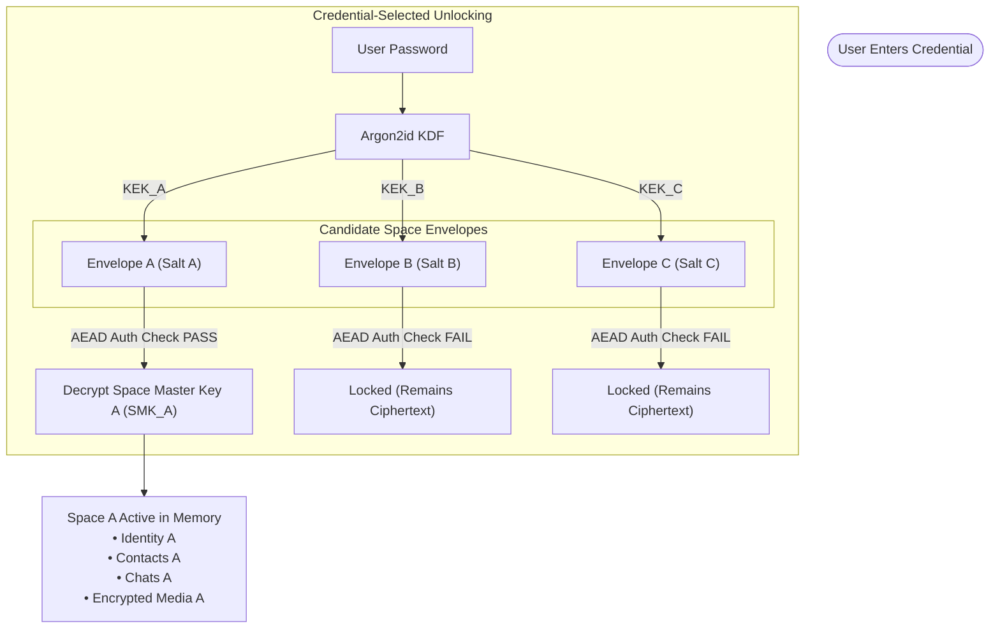

# SPACE_ARCHITECTURE.md — Multi-Space Isolation & Credential-Selected Unlocking

## 1. Concept and Rationale

The core innovation of VEIL is the **Space Architecture**:
A single VEIL client installation supports multiple, fully isolated **Spaces** (e.g. Main Space, Work Space, Private Space, optional Decoy Space).

Each Space is an independent cryptographic vault. There is no "global master key" that unlocks all Spaces simultaneously. Unlocking one Space leaves all other Spaces in an unreadable, ciphertext-only state.



---

## 2. Space Storage & Envelope Structure

Each Space on disk is represented by a unique `spaceId` (UUIDv4) and two distinct storage records:
1. **Space Header Envelope** (Public/Unauthenticated metadata index containing cryptographic challenge parameters).
2. **Encrypted Space Partition / Database** (Encrypted application state, contacts, messages, ratchet sessions, prekeys).

### Space Header Envelope JSON Format

```typescript
interface SpaceHeaderEnvelope {
  /** Unique random identifier for the space */
  spaceId: string;
  
  /** Schema version */
  version: 1;
  
  /** Display name encrypted inside the envelope or optional public alias */
  isDecoy: boolean;
  
  /** Argon2id Key Derivation Parameters */
  kdfParams: {
    algorithm: 'argon2id';
    salt: string;        // 32 bytes, base64 encoded
    timeCost: number;    // e.g. 3 iterations
    memoryCost: number;  // e.g. 65536 KiB (64 MiB)
    parallelism: number; // e.g. 1 thread
    keyLength: number;   // 32 bytes (256 bits)
  };
  
  /** Sealed Space Master Key (SMK) Envelope */
  encryptedMasterKey: {
    algorithm: 'XChaCha20-Poly1305' | 'AES-256-GCM';
    nonce: string;       // 24 bytes (XChaCha20) or 12 bytes (AES-GCM), base64
    ciphertext: string;  // Encrypted 32-byte SMK + 16-byte authentication tag, base64
  };
  
  /** Creation timestamp */
  createdAt: number;
}
```

---

## 3. Unlocking Protocol (Credential Selection)

When the user enters a password on the unlock screen:

1. The client loads the list of registered `SpaceHeaderEnvelope` records from local storage.
2. For each envelope:
   - Derives a candidate `KEK_candidate = Argon2id(password, envelope.kdfParams.salt, params)`.
   - Attempts to decrypt `envelope.encryptedMasterKey.ciphertext` using `KEK_candidate` and `envelope.encryptedMasterKey.nonce`.
3. **If AEAD authentication succeeds**:
   - The decrypted payload is the verified 32-byte `SpaceMasterKey` (SMK).
   - Space session is initialized in volatile memory with `SMK`.
   - Subkeys are expanded via HKDF for database storage, identity signing, and Double Ratchet sessions.
   - The client transitions immediately to the decrypted Space UI.
4. **If AEAD authentication fails for all envelopes**:
   - The client returns a generic "Invalid credential" error message.
   - All candidate KEK buffers are immediately zeroized.
5. **Decoy Space Handling**:
   - If the user entered a password configured for the Decoy Space, the Decoy Space envelope matches and unlocks.
   - The client loads the Decoy Space seamlessly without displaying error prompts or indicating that other Spaces exist.

---

## 4. Cryptographic Space Isolation Guarantees

| Attack / Access Attempt | Defensive Guarantee | Technical Mechanism |
| :--- | :--- | :--- |
| **Cross-Space Read**: Active Space A queries Space B's database | **Prevented** | Space B's database is encrypted under `StorageKey_B = HKDF(SMK_B)`. Since `SMK_B` is unrecovered, Space B data is mathematically unreadable. |
| **Tampered Header**: Attacker modifies salt or ciphertext | **Prevented** | AEAD Poly1305 / GCM tag validation fails; envelope is rejected. |
| **Memory Dump**: Device seized while Space B is locked | **Protected** | `SMK_B` never exists in memory while Space B is locked. Only `SMK_A` of the active Space resides in volatile RAM. |
| **Password Guessing**: Offline brute-force attack | **Mitigated** | Memory-hard Argon2id (64 MiB, 3 iterations) exponentially slows down GPU/ASIC dictionary attacks. |

---

## 5. Memory Lifecycle & Panic Lock

- **Active Space Session**: Holds the active `SMK` and derived subkeys in a secure `SpaceSession` class in memory.
- **Auto-Lock Timer**: Configurable idle timeout (e.g. 30s, 1m, 5m, immediate upon backgrounding). Triggers `session.destroy()`.
- **Panic Lock Action**:
  1. Calls `buffer.fill(0)` on all active key buffers (SMK, KEK, subkeys, ratchet states).
  2. Nullifies active UI session state and resets navigation to the locked screen.
  3. Purges in-memory decrypted message cache.
